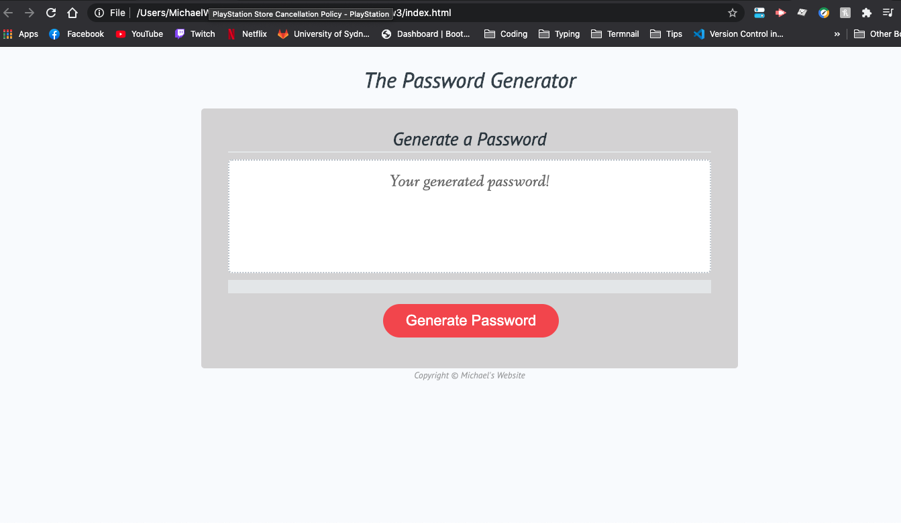

# Password Generator

## Contents

The app is composed of 3 pages, index.html, javascript.js and style.css. It also has images in the img folder

## User Story

As a type of user, I want to password generator task so that I can achieve sercure password with mutliple was of entry and encrypting for all my password needs.

## Built With

* [VScode](https://code.visualstudio.com/) - The editor of choice
* [Terminal](https:///) - What would we do without our bash?

#### Initial interface

### Licence

### Link to the App
<a href="https://michaelmw17.github.io/homeworkw3">Password Generator</a>

## Questions

_Michael Watt_

- [Github!](https://github.com/Michaelmw17)
- [LinkedIn!](https://www.linkedin.com/in/michael-watt-6a76961b3/)
- [Portfolio!](http://michaelmw17.github.io/)
- Email:(michaelmw17@outlook.com)

